<!-- Header -->
<p align="center">
  
</p>


<!-- Typing SVG — cycles: Developer → Designer, both "by day, Gamer by night" 
<p align="center">
  <a href="https://git.io/typing-svg">
    
  </a>
</p>
-->

<br>


# `> whoami`

```yaml
name      : Baidehi Samantray
pronouns  : she/her
currently : building things, breaking things, learning things
```

- 🔭 I build interactive websites that blend design with code
- 👯 Open for collabs on creative web projects or ML experiments
- 🌱 Currently honing ML skills and front-end wizardry
- ⚡ I enjoy turning random ideas into tiny experiments

<!-- Meme badge strip -->
<p align="left">
  
  <!--  -->
  
  
</p>


<br>


# SKILLS

<!-- Languages -->
**Languages**


**Frameworks & Libraries**


**Databases & Cloud**


**Design & Creative**


**ML / Data**


**Tools & Others**


**Currently on my 6th life** 🎮


<br>

# SOCIALS

[](https://instagram.com/shweyeah_)
[](https://linkedin.com/in/baidehisamantray)
[](mailto:baidehi.shreya@gmail.com)

<br>

<!-- Snake animation — see setup note below -
  
</p>
->
<p align="center">
<!-- Footer -->
<p align="center">
  
</p>


<!--
**Baidehi25/Baidehi25** is a ✨ _special_ ✨ repository because its `README.md` (this file) appears on your GitHub profile.

Here are some ideas to get you started:

- 🔭 I’m currently working on ...
- 🌱 I’m currently learning ...
- 👯 I’m looking to collaborate on ...
- 🤔 I’m looking for help with ...
- 💬 Ask me about ...
- 📫 How to reach me: ...
- 😄 Pronouns: ...
- ⚡ Fun fact: ...
-->
